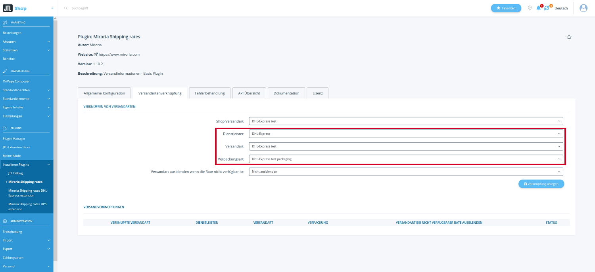
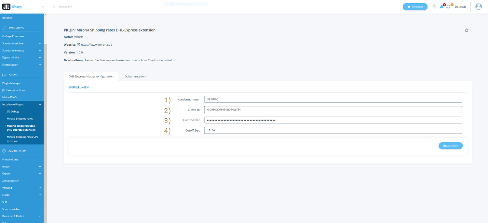
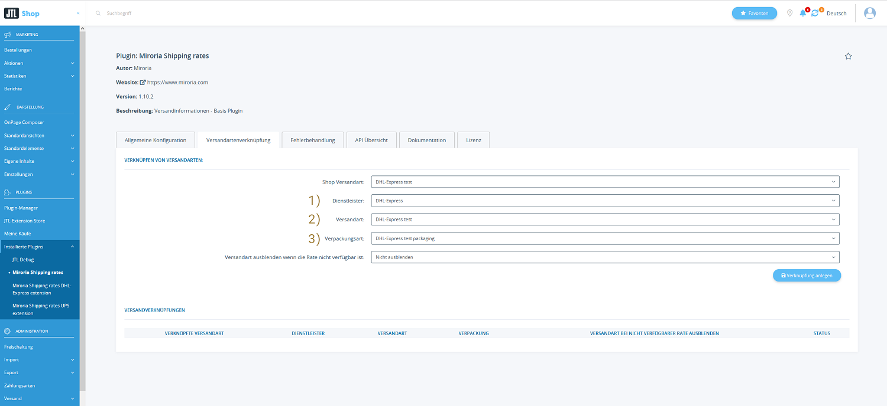

# Shipping Rate Plugin DHL-Express Extension

---

## Installationsanleitung für "Versandkosten und Lieferzeit automatisch beziehen - DHL-Express Erweiterung"

Diese Anleitung führt Sie durch den Installationsprozess des Plugins "Versandkosten und Lieferzeit automatisch
beziehen - DHL-Express Extension" für JTL Shop. Sie enthält auch Schritte zur Überprüfung der korrekten Installation.

Um das Plugin zu nutzen **benötigen** Sie einen DHL-Express-Entwicklerzugang.
Eine Anleitung finden Sie im Abschnitt [DHL-Express Konfiguration](#dhl-express-konfiguration). 

### Schritt 1: Plugin erwerben

1. Besuchen Sie den Extension Store.
2. Suchen Sie nach "Versandkosten und Lieferzeit automatisch beziehen - DHL-Express extension" und erwerben Sie es entsprechend.

### Schritt 2: Plugin installieren

1. Öffnen Sie den Admin-Bereich Ihres JTL Shops.
2. Navigieren Sie zu `"Plugins" > "Plugin Manager"`.
3. Suchen Sie nach dem erworbenen Plugin in der Plugin-Liste.
4. Klicken Sie auf "Installieren", um den Installationsprozess zu starten.

### Schritt 3: Überprüfung

1. Navigieren Sie zu den Basis-Plugin-Einstellungen unter `"Plugins" > "Installierte Plugins" > "Miroria Shipping Rates > Versandartenverknüpfung"`.
2. Prüfen Sie, dass der Dienstleister "DHL-Express" verfügbar ist.

Herzlichen Glückwunsch! Sie haben erfolgreich das "Versandkosten und Lieferzeit automatisch beziehen - DHL-Express Erweiterung" in Ihren JTL Shop integriert.

Bei Problemen oder Fragen können Sie sich an support@miroria.de wenden.

---

## Konfiguration & Bedienung

Diese Anleitung führt Sie durch die Konfiguration und Bedienung des Plugins "Versandkosten und Lieferzeit automatisch
beziehen - DHL-Express Erweiterung" für JTL Shop. Die Plugin-Konfiguration ist in zwei Abschnitte unterteilt: Die DHL-Express Nutzerkonfiguration
und die Versandartenverknüpfung.

1. Öffnen Sie den Admin-Bereich Ihres JTL Shops.
2. Navigieren Sie zu `"Plugins" > "Installierte Plugins" > "Miroria Shipping Rates DHL-Express extension"`.

### DHL-Express Konfiguration

#### DHL-Express Entwickleraccount
Um die DHL-Express-Schnittstelle zu Nutzen benötigen Sie einen DHL-Express Entwickler-Account.
Gerne helfen wir Ihnen bei der Einrichtung Ihres Accounts. Nutzen Sie dafür den Einrichtungsservice, welchen sie im JTL-Extension Store zum Plugin dazubuchen können.
Weitere Informationen finden Sie [hier](https://developer.dhl.com/api-reference/dhl-express-mydhl-api?language_content_entity=en#get-started-section/)

#### DHL-Express Plugin Konfiguration
Konfigurieren Sie den DHL-Express-Nutzer im Plugin.

1. `Kundennummer`: Sie finden die Kundennummer.
2. `Client Id`: Verwenden Sie die ClientId der App.
3. `Client Secret`: Verwenden Sie das Client secret der App.
4. `Cutoff Zeit`: Bis zu diesem Zeitpunk können Bestellungen noch am selben Tag an DHL-Express übergeben werden.

### Versandartenverknüpfung
DHL-Express-Versandarten können Sie über die Plugin-Einstellungen des Basis-Plugins verknüpfen.

1. `Dienstleister`: Wählen Sie hier `DHL-Express` aus
2. `Versandart`: Auswahl der für DHL-Express verfügbaren Versandarten.
3. `Verpackungsart`: Auswahl der für DHL-Express verfügbaren Verpackungsarten.

## Bedienung des Plugins im Shop

Sie finden die Dokumentation zur Bedienung im Shop in der Dokumentation des Basis-Plugins