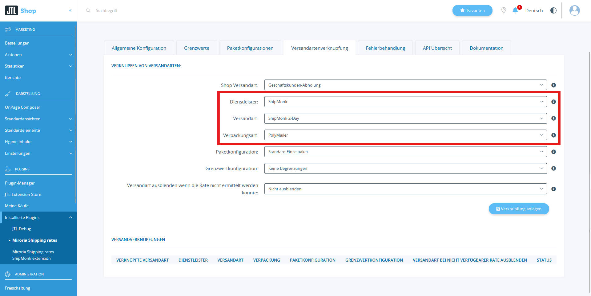
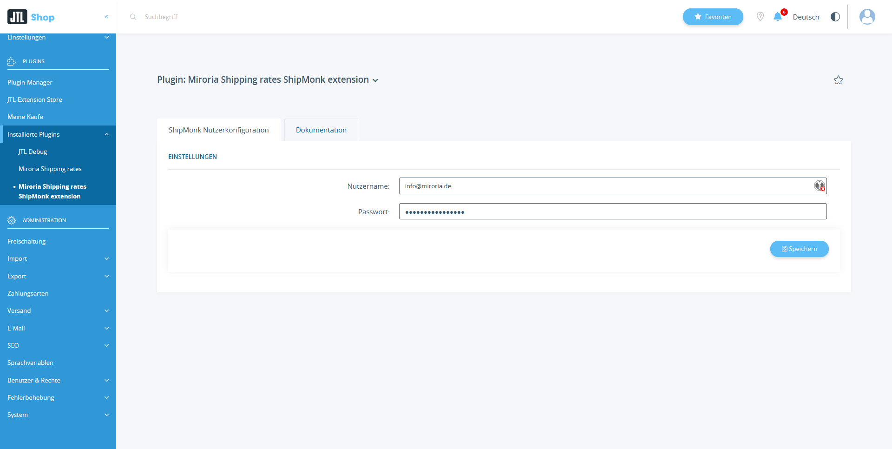
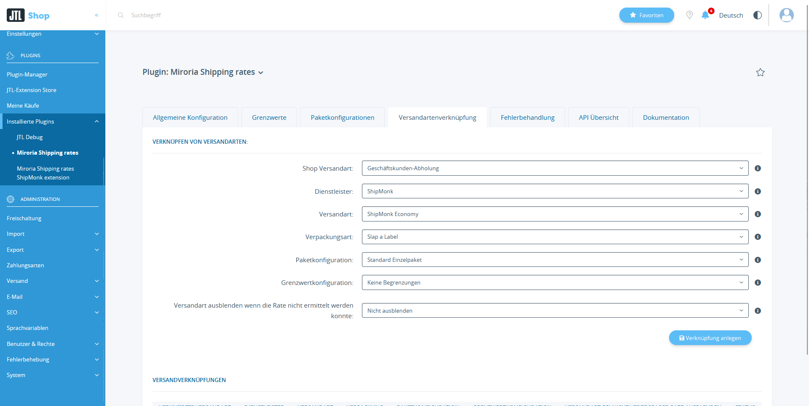

# Shipping Rate Plugin ShipMonk Extension

Das Plugin befindet sich aktuell noch in der **Beta-Phase**.

Bei Fragen, Problemen oder Wünschen können Sie sich gerne an support@miroria.de wenden.

---

## Installationsanleitung für "Versandkosten und Lieferzeit automatisch beziehen - ShipMonk Erweiterung"

Diese Anleitung führt Sie durch den Installationsprozess des Plugins "Versandkosten und Lieferzeit automatisch
beziehen - ShipMonk Extension" für JTL Shop. Sie enthält auch Schritte zur Überprüfung der korrekten Installation.

Um das Plugin zu nutzen **benötigen** Sie einen ShipMonk Zugang.
Weitere Informationen finden Sie hier [ShipMonk Konfiguration](#shipmonk-konfiguration). 

### Schritt 1: Plugin erwerben

1. Besuchen Sie den Extension Store.
2. Suchen Sie nach "Versandkosten und Lieferzeit automatisch beziehen - ShipMonk extension" und erwerben Sie es entsprechend.

### Schritt 2: Plugin installieren

1. Öffnen Sie den Admin-Bereich Ihres JTL Shops.
2. Navigieren Sie zu `"Plugins" > "Plugin Manager"`.
3. Suchen Sie nach dem erworbenen Plugin in der Plugin-Liste.
4. Klicken Sie auf "Installieren", um den Installationsprozess zu starten.

### Schritt 3: Überprüfung

1. Navigieren Sie zu den Basis-Plugin-Einstellungen unter `"Plugins" > "Installierte Plugins" > "Miroria Shipping Rates > Versandartenverknüpfung"`.
2. Prüfen Sie, dass der Dienstleister "ShipMonk" verfügbar ist.

Herzlichen Glückwunsch! Sie haben erfolgreich das "Versandkosten und Lieferzeit automatisch beziehen - ShipMonk Erweiterung" in Ihren JTL Shop integriert.

Bei Problemen oder Fragen können Sie sich an support@miroria.de wenden.

---

## Konfiguration & Bedienung

Diese Anleitung führt Sie durch die Konfiguration und Bedienung des Plugins "Versandkosten und Lieferzeit automatisch
beziehen - ShipMonk Erweiterung" für JTL Shop. Die Plugin-Konfiguration ist in zwei Abschnitte unterteilt: Die ShipMonk Nutzerkonfiguration
und die Versandartenverknüpfung.

1. Öffnen Sie den Admin-Bereich Ihres JTL Shops.
2. Navigieren Sie zu `"Plugins" > "Installierte Plugins" > "Miroria Shipping Rates ShipMonk extension"`.

### ShipMonk Konfiguration

#### ShipMonk Zugang
Um die ShipMonk-Schnittstelle zu Nutzen benötigen Sie einen ShipMonk Account.
Gerne helfen wir Ihnen bei der Einrichtung Ihres Accounts. Nutzen Sie dafür den Einrichtungsservice, welchen sie im JTL-Extension Store zum Plugin dazubuchen können.
Weitere Informationen finden Sie [hier](Weitere Informationen finden Sie [hier](https://support.shipmonk.com/s/article/Merchant-Onboarding-Options)

#### ShipMonk Plugin Konfiguration
Konfigurieren Sie den ShipMonk-Nutzer im Plugin.

1. `Nutzername`: Wir empfehlen es, einen extra Nutzer für das Plugin anzulegen.
2. `Passwort`: Verwenden Sie das Passwort des Nutzers.

### Versandartenverknüpfung
ShipMonk-Versandarten können Sie über die Plugin-Einstellungen des Basis-Plugins verknüpfen.

1. `Dienstleister`: Wählen Sie hier `ShipMonk` aus
2. `Versandart`: Auswahl der für ShipMonk verfügbaren Versandarten.
3. `Verpackungsart`: Auswahl der für ShipMonk verfügbaren Verpackungsarten.

## Bedienung des Plugins im Shop

Sie finden die Dokumentation zur Bedienung im Shop in der Dokumentation des Basis-Plugins