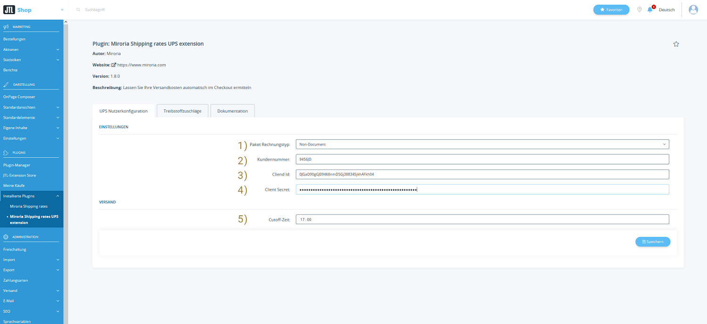
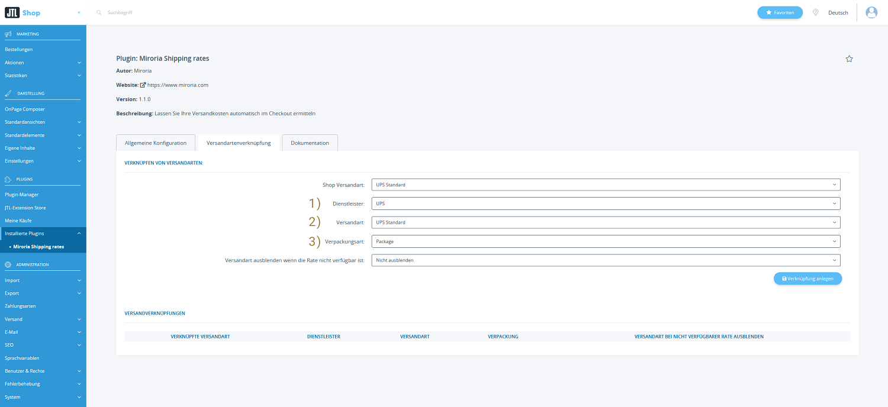

# Shipping Rate Plugin Ups Extension

---

## Installationsanleitung für "Versandkosten und Lieferzeit automatisch beziehen - UPS Erweiterung"

Diese Anleitung führt Sie durch den Installationsprozess des Plugins "Versandkosten und Lieferzeit automatisch
beziehen - UPS Extension" für JTL Shop. Sie enthält auch Schritte zur Überprüfung der korrekten Installation.

### Schritt 1: Plugin erwerben

1. Besuchen Sie den Extension Store.
2. Suchen Sie nach "Versandkosten und Lieferzeit automatisch beziehen - UPS extension" und erwerben Sie es entsprechend.

### Schritt 2: Plugin installieren

1. Öffnen Sie den Admin-Bereich Ihres JTL Shops.
2. Navigieren Sie zu `"Plugins" > "Plugin Manager"`.
3. Suchen Sie nach dem erworbenen Plugin in der Plugin-Liste.
4. Klicken Sie auf "Installieren", um den Installationsprozess zu starten.

### Schritt 3: Überprüfung

1. Navigieren Sie zu den Basis-Plugin-Einstellungen unter `"Plugins" > "Installierte Plugins" > "Miroria Shipping Rates > Versandartenverknüpfung"`.
2. Prüfen Sie, dass der Dienstleister "UPS" verfügbar ist. 

Herzlichen Glückwunsch! Wenn der Versandpreis entsprechend erhöht wurde, haben Sie erfolgreich das "Versandkosten und
Lieferzeit automatisch beziehen - UPS Erweiterung" in Ihren JTL Shop integriert.

Bei Problemen oder Fragen können Sie sich an support@miroria.de wenden.

---

## Konfiguration & Bedienung

Diese Anleitung führt Sie durch die Konfiguration und Bedienung des Plugins "Versandkosten und Lieferzeit automatisch
beziehen - UPS Erweiterung" für JTL Shop. Die Plugin-Konfiguration ist in zwei Abschnitte unterteilt: Die UPS Nutzerkonfiguration
und die Versandartenverknüpfung.

1. Öffnen Sie den Admin-Bereich Ihres JTL Shops.
2. Navigieren Sie zu `"Plugins" > "Installierte Plugins" > "Miroria Shipping Rates UPS extension"`.

### Allgemeine Konfiguration

Hier können Sie allgemeine Plugin-Konfigurationen vornehmen.

1. `Ländercode`:
   Der [ISO-Ländercode](https://en.wikipedia.org/wiki/ISO_3166-1_alpha-2#Officially_assigned_code_elements) der
   Absenderadresse
2. `Postleitzahl`: Die PLZ der Absenderadresse
3. `Stadt`: Der Ort der Absenderadresse
4. `Straße`: Die Straße der Absenderadresse

### Versandartenverknüpfung

Hier können Sie Versandarten aus dem Shop mit den Versanddienstleistern verknüpfen.

1. `Shop Versandart`: Auswahl an im Shop unter `"Administration" > "Versand" > "Versandarten"` definierten Versandarten
2. `Dienstleister`: Auswahl an verfügbaren Dienstleistern. Fügen Sie weitere Dienstleister durch unsere [Extensions]()
   hinzu.
   Im Basis-Plugin gibt es die Option eine Versandart `Zusatzgebühr` zu verwenden. Auf die verknüpfte Versandart wird
   dann die konfigurierte `Zusatzgebühr` gerechnet.
   Bisher verfügbare Extensions:
    1. [UPS]()

   In Planung:
    1. Shipmonk
    2. DHL
    3. FedEx
3. `Versandart`: Vom Dienstleister bereitgestellte Versandarten.
4. `Verpackungsart`: Vom Dienstleister bereitgestellte Verpackungsarten.
5. `Versandart ausblenden wenn die Rate nicht verfügbar ist`: Soll die Versandart im Warenkorb ausgeblendet werden, wenn
   die Rate nicht vom Dienstleister bezogen werden konnte
6. `Verknüpfung anlegen`: Anlegen und freischalten der Verknüpfung.
7. `Versandverknüpfungen`: Hier können Sie bereits verknüpfte Versandarten sehen und löschen.

## Bedienung des Plugins im Shop

Sie finden die Dokumentation zur Bedienung im Shop in der Dokumentation des Basis-Plugins