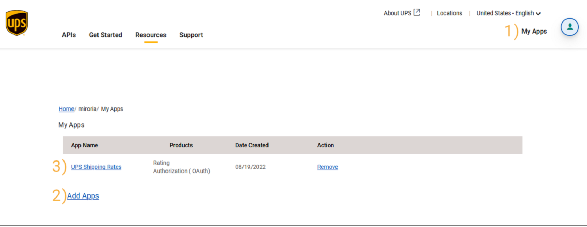

# Shipping Rate Plugin Ups Extension

---

## Installationsanleitung für "Versandkosten und Lieferzeit automatisch beziehen - UPS Erweiterung"

Diese Anleitung führt Sie durch den Installationsprozess des Plugins "Versandkosten und Lieferzeit automatisch
beziehen - UPS Extension" für JTL Shop. Sie enthält auch Schritte zur Überprüfung der korrekten Installation.

Um das Plugin zu nutzen **benötigen** Sie einen UPS-Entwicklerzugang.
Eine Anleitung finden Sie im Abschnitt [UPS Konfiguration](#ups-konfiguration). 

### Schritt 1: Plugin erwerben

1. Besuchen Sie den Extension Store.
2. Suchen Sie nach "Versandkosten und Lieferzeit automatisch beziehen - UPS extension" und erwerben Sie es entsprechend.

### Schritt 2: Plugin installieren

1. Öffnen Sie den Admin-Bereich Ihres JTL Shops.
2. Navigieren Sie zu `"Plugins" > "Plugin Manager"`.
3. Suchen Sie nach dem erworbenen Plugin in der Plugin-Liste.
4. Klicken Sie auf "Installieren", um den Installationsprozess zu starten.

### Schritt 3: Überprüfung

1. Navigieren Sie zu den Basis-Plugin-Einstellungen unter `"Plugins" > "Installierte Plugins" > "Miroria Shipping Rates > Versandartenverknüpfung"`.
2. Prüfen Sie, dass der Dienstleister "UPS" verfügbar ist. 

Herzlichen Glückwunsch! Sie haben erfolgreich das "Versandkosten und Lieferzeit automatisch beziehen - UPS Erweiterung" in Ihren JTL Shop integriert.

Bei Problemen oder Fragen können Sie sich an support@miroria.de wenden.

---

## Konfiguration & Bedienung

Diese Anleitung führt Sie durch die Konfiguration und Bedienung des Plugins "Versandkosten und Lieferzeit automatisch
beziehen - UPS Erweiterung" für JTL Shop. Die Plugin-Konfiguration ist in zwei Abschnitte unterteilt: Die UPS Nutzerkonfiguration
und die Versandartenverknüpfung.

1. Öffnen Sie den Admin-Bereich Ihres JTL Shops.
2. Navigieren Sie zu `"Plugins" > "Installierte Plugins" > "Miroria Shipping Rates UPS extension"`.

### UPS Konfiguration

#### UPS Entwickleraccount
Um die UPS-Schnittstelle zu Nutzen benötigen Sie einen UPS-Account.
Gerne helfen wir Ihnen bei der Einrichtung Ihres Accounts. Nutzen Sie dafür den Einrichtungsservice, welchen sie im JTL-Extension Store zum Plugin dazubuchen können.

+ Melden Sie sich im [UPS-Entwicklerportal](https://developer.ups.com/get-started?loc=en_US) an
+ Klicken Sie auf `My Apps` (1)
+ Klicken Sie auf `Add Apps` (2)
+ Wählen Sie den zu verknüpfenden UPS-Account aus
+ Sie benötigen Zugriff für die `OAuth` und `Rating` Produkte.
+ Anschließend finden Sie Ihre neue App in der Liste (3)
+ Sie finden die ClientId (4), das Client Secret (5) und die Kundennummer (6) in den App-Details

#### UPS Plugin Konfiguration
Konfigurieren Sie den UPS-Nutzer im Plugin.

1. `Paket Rechnungstyp`: Wählen Sie aus, ob Sie die Rechnung dem Paket beilegen.
2. `Kundennummer`: Sie finden die Kundennummer.
3. `Client Id`: Verwenden Sie die ClientId der App.
4. `Client Secret`: Verwenden Sie das Client secret der App.
5. `Cutoff Zeit`: Bis zu diesem Zeitpunk können Bestellungen noch am selben Tag an UPS übergeben werden.

### Versandartenverknüpfung
UPS-Versandarten können Sie über die Plugin-Einstellungen des Basis-Plugins verknüpfen.

1. `Dienstleister`: Wählen Sie hier `UPS` aus
2. `Versandart`: Auswahl der für UPS verfügbaren Versandarten
3. `Verpackungsart`: Auswahl der für UPS verfügbaren Verpackungsarten.

## Bedienung des Plugins im Shop

Sie finden die Dokumentation zur Bedienung im Shop in der Dokumentation des Basis-Plugins