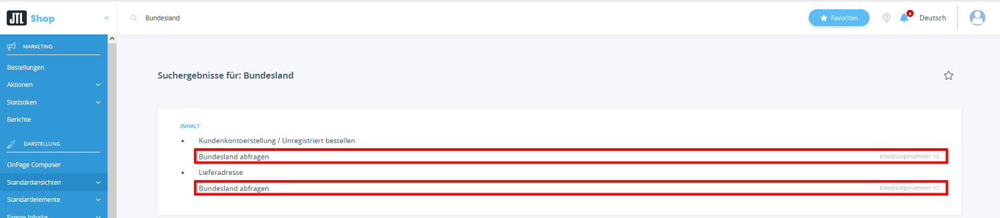
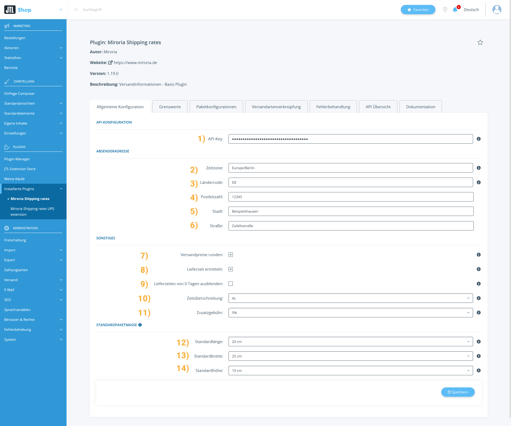
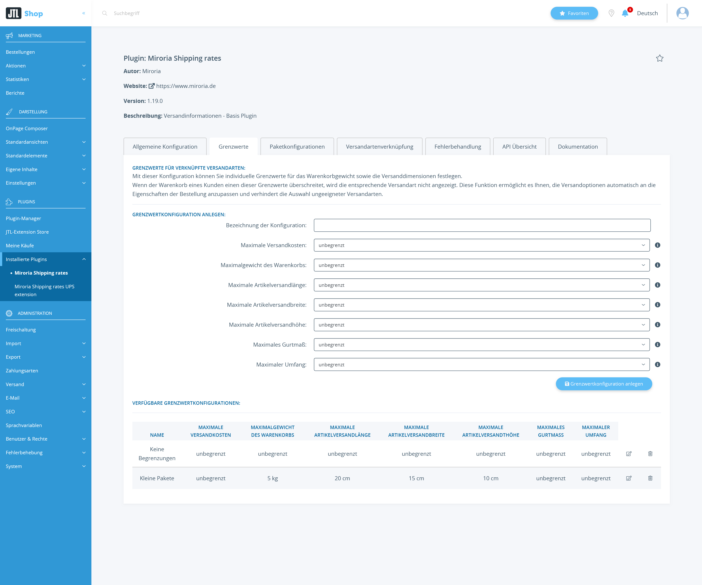
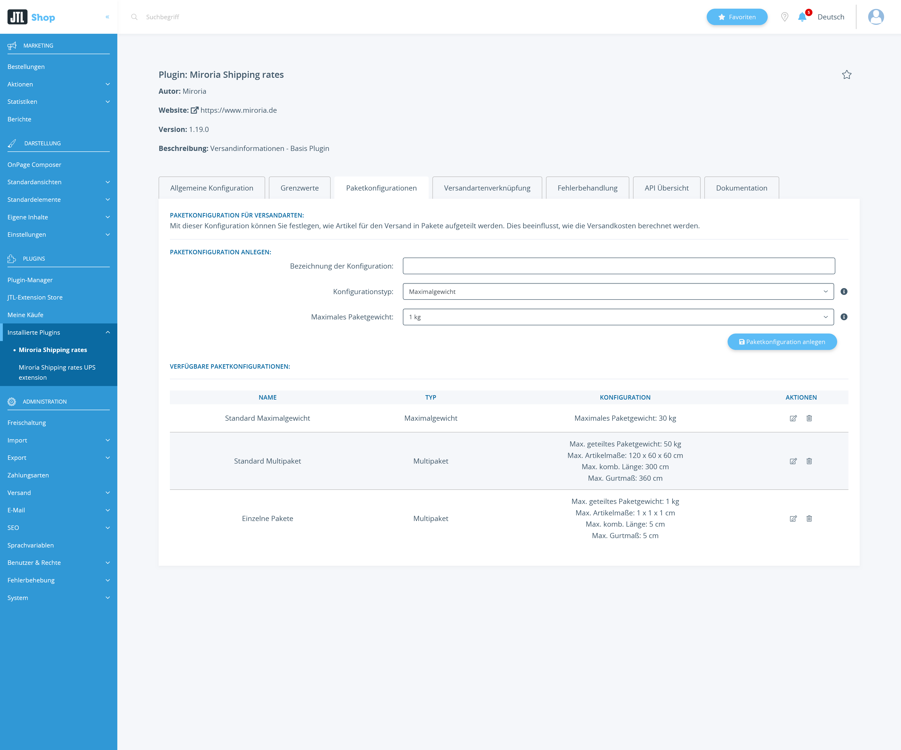
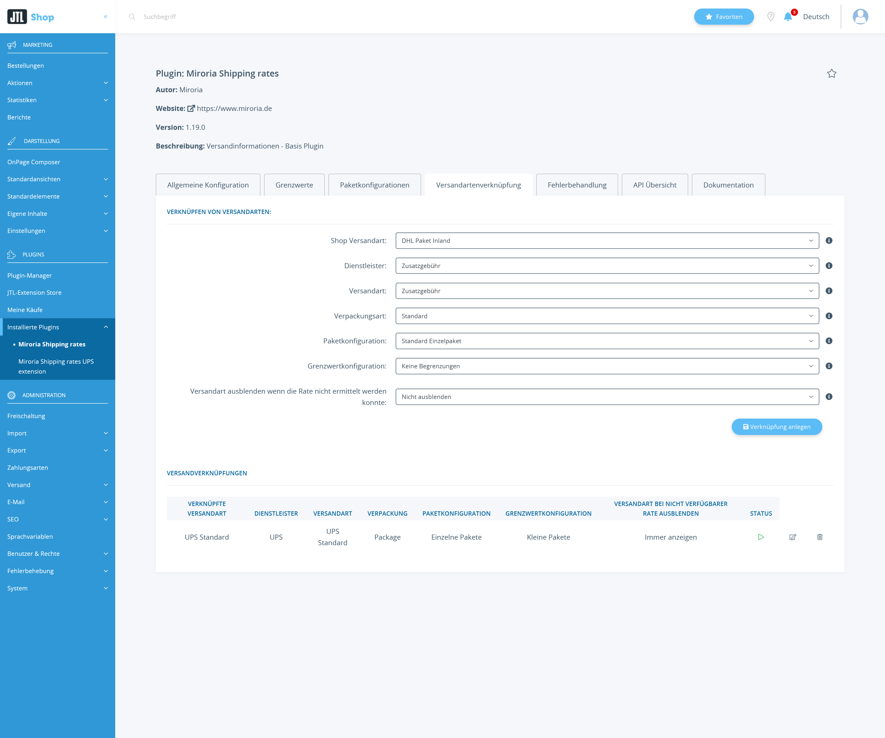
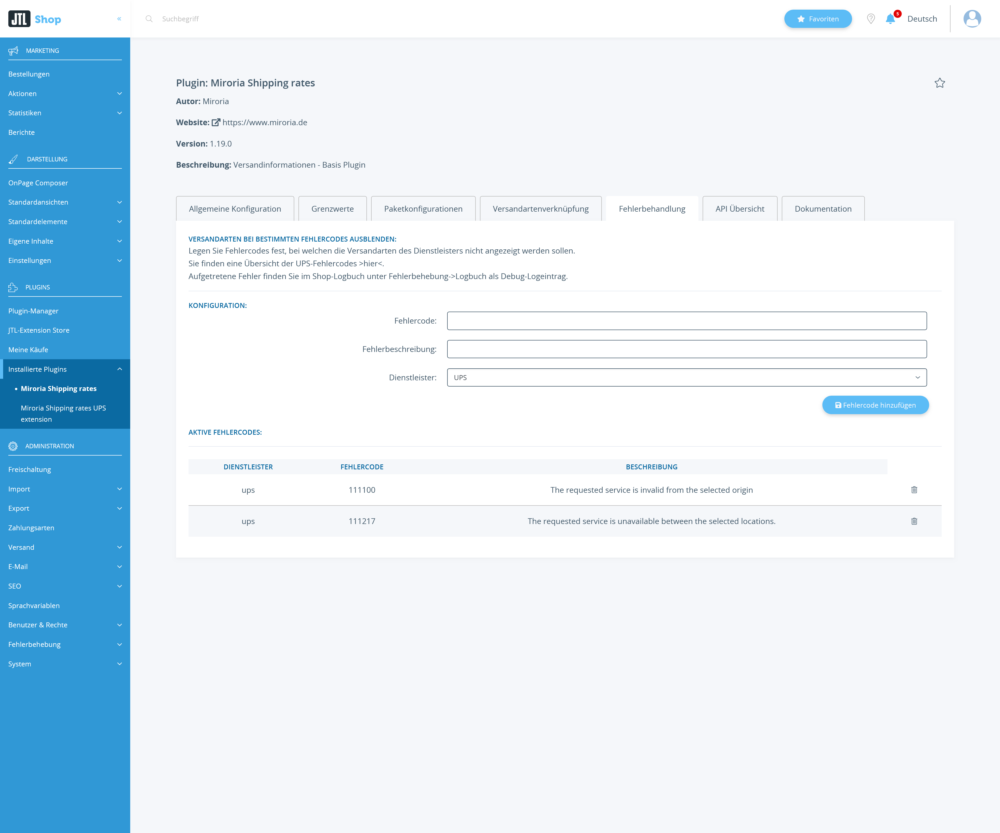
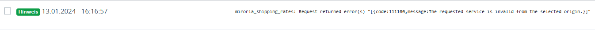
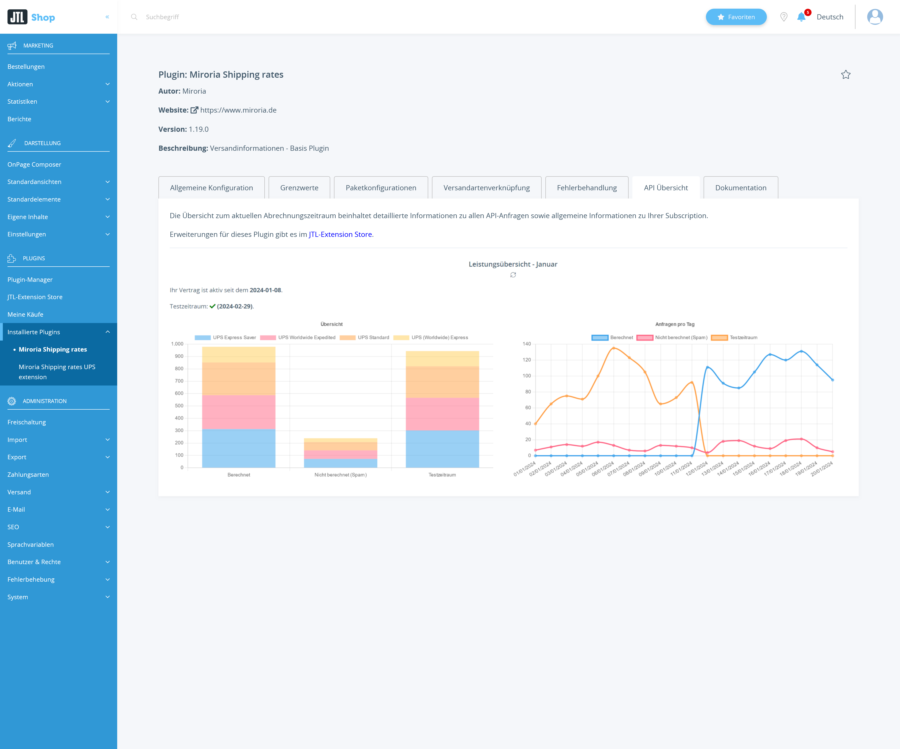
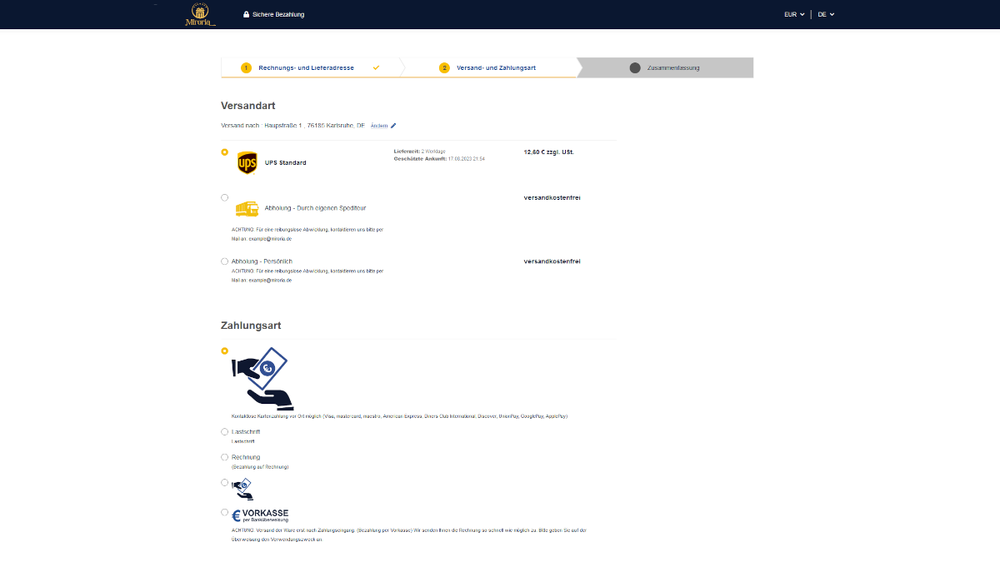
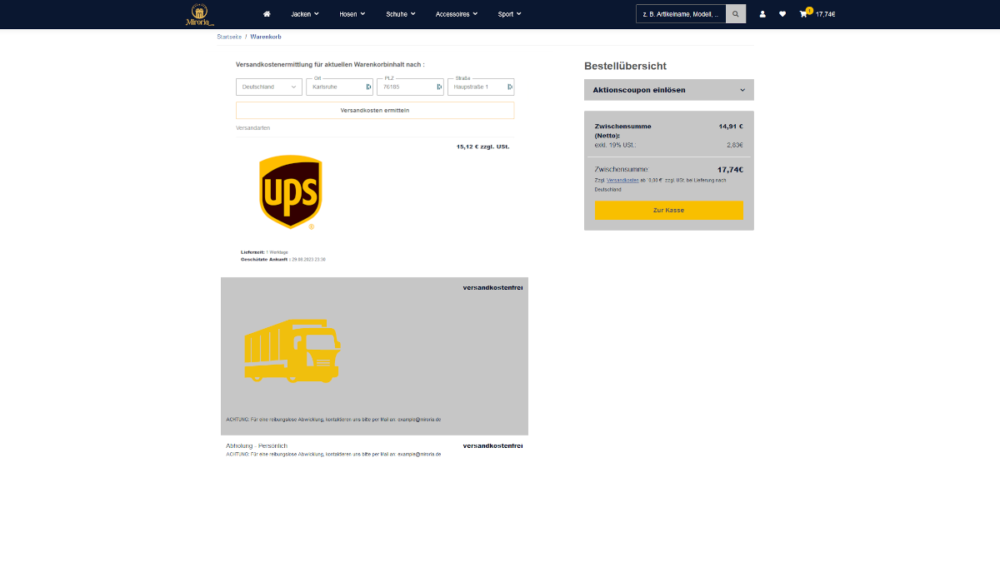

# Miroria Shipping rates

---
## Installationsanleitung für "Versandkosten und Lieferzeit automatisch beziehen - Basis Plugin"

Diese Anleitung führt Sie durch den Installationsprozess des Plugins "Versandkosten und Lieferzeit automatisch beziehen - Basis Plugin" für JTL Shop. Sie enthält auch Schritte zur Überprüfung der korrekten Installation.

### Schritt 1: Plugin erwerben

1. Besuchen Sie den Extension Store.
2. Suchen Sie nach "Versandkosten und Lieferzeit automatisch beziehen - Basis Plugin" und erwerben Sie es entsprechend.

### Schritt 2: Plugin installieren

1. Öffnen Sie den Admin-Bereich Ihres JTL Shops.
2. Navigieren Sie zu `"Plugins" > "Plugin Manager"`.
3. Suchen Sie nach dem erworbenen Plugin in der Plugin-Liste.
4. Klicken Sie auf "Installieren", um den Installationsprozess zu starten.
5. Aktivieren Sie die Shop-Einstellung Nr 13 und 17 (Bundesland abfragen) um möglichst genauere Versandkosten und Lieferzeiten zu erhalten

### Schritt 3: Überprüfung

1. Navigieren Sie zu den Plugin-Einstellungen unter `"Plugins" > "Installierte Plugins" > "Miroria Shipping Rates"`.
2. Setzen Sie die Einstellung `Zusatzgebühr` auf 10%.
3. Verknüpfen Sie eine Versandart in den Plugin-Einstellungen unter `Versandarten`.
4. Besuchen Sie Ihren JTL Shop und legen Sie ein Produkt in den Warenkorb.
5. Gehen Sie zum Checkout und wählen Sie die verknüpfte Versandart aus.
6. Überprüfen Sie, ob der Versandpreis im Checkout um 10% erhöht ist.

Herzlichen Glückwunsch! Wenn der Versandpreis entsprechend erhöht wurde, haben Sie erfolgreich das "Versandkosten und Lieferzeit automatisch beziehen - Basis Plugin" in Ihren JTL Shop integriert.

Bei Problemen oder Fragen können Sie sich an support@miroria.de wenden.

---
## Konfiguration & Bedienung

Diese Anleitung führt Sie durch die Konfiguration und Bedienung des Plugins "Versandkosten und Lieferzeit automatisch beziehen - Basis Plugin" für den JTL Shop. Die Plugin-Konfiguration ist in einen Abschnitt pro Reiter unterteilt.
1. Öffnen Sie den Admin-Bereich Ihres JTL Shops.
2. Navigieren Sie zu `"Plugins" > "Installierte Plugins" > "Miroria Shipping Rates"`.

### Allgemeine Konfiguration
Hier können Sie allgemeine Plugin-Konfigurationen vornehmen.

`API-Konfiguration`:

1. `API-Key`: Beantragen Sie <ins>[hier](https://www.miroria.de/jtl-versandkosten-und-lieferzeiten/#zugang-beantragen)</ins> einen API-Key

`Absenderadresse`: Bei der Installation des Plugins wird sie auf die im Shop hinterlegte Firmenadresse gesetzt.

2. `Zeitzone`: Die Zeitzone in welcher sich Ihr Unternehmen befindet.
3. `Ländercode`: Der [ISO-Ländercode](https://en.wikipedia.org/wiki/ISO_3166-1_alpha-2#Officially_assigned_code_elements) der Absenderadresse
4. `Postleitzahl`: Die PLZ der Absenderadresse
5. `Stadt`: Der Ort der Absenderadresse
6. `Straße`: Die Straße der Absenderadresse

`Sonstiges`:

7. `Versandpreise runden`: Versandpreise können auf die erste Nachkommastelle gerundet werden. Wird beispielsweise ein Versandpreis von 5.76€ ermittelt wird dieser auf 5.80€ gerundet. 
8. `Lieferzeiten von 0 Tagen ausblenden`: Blendet Lieferzeiten von 0 Tagen aus. Die Versandart und der Versandpreis werden weiterhin angezeigt.
9. `Lieferzeit ermitteln`: Wenn aktiviert, wird die Lieferzeit beim Versanddienstleister ermittelt. Andernfalls wird die in der Versandart hinterlegte Lieferzeit verwendet.
10. `Zeitüberschreitung`: Hier kann eine Zeitüberschreitung definiert werden. Anfragen gegen die Versanddienstleister werden nach Überschreitung abgebrochen und es werden als Fallback-Preis und Lieferzeit die in der Versandart definierten Werte verwendet.
11. `Zusatzgebühr`: Sie können außerdem einen Zusatzgebühren-Prozentsatz einstellen. Dieser wird auf die Versandkosten gerechnet.

`Standardpaketmaße`:

Diese Einstellungen werden verwendet, falls für einen Artikel keine spezifischen Versandmaße hinterlegt sind.
12. `Standardlänge`: Voreingestellte Länge für Pakete (in cm)
13. `Standardbreite`: Voreingestellte Breite für Pakete (in cm)
14. `Standardhöhe`: Voreingestellte Höhe für Pakete (in cm)

### Grenzwertkonfigurationen

Grenzwertkonfigurationen ermöglichen es Ihnen, Limits für verschiedene Aspekte des Versands festzulegen. Wenn diese Grenzwerte überschritten werden, wird die zugehörige Versandart nicht angezeigt oder es werden alternative Versandoptionen verwendet.

#### Verfügbare Grenzwerte

- Maximaler Versandpreis
- Maximales Warenkorbgewicht
- Maximale Versandlänge
- Maximale Versandbreite
- Maximale Versandhöhe
- Maximale kombinierte Länge
- Maximales Gurtmaß

#### Konfiguration erstellen

1. Navigieren Sie zu `"Plugins" > "Installierte Plugins" > "Miroria Shipping Rates" > "Grenzwerte"`.
2. Klicken Sie auf "Grenzwertkonfiguration anlegen".
3. Geben Sie einen Namen für die Konfiguration ein.
4. Setzen Sie die gewünschten Grenzwerte.
5. Speichern Sie die Konfiguration.

#### Anwendung der Grenzwertkonfiguration

Ähnlich wie bei den Paketkonfigurationen können Sie Grenzwertkonfigurationen [Versandartenverknüpfungen](#versandartenverknüpfung) zuweisen:

1. Gehen Sie zu `"Plugins" > "Installierte Plugins" > "Miroria Shipping Rates" > "Versandartenverknüpfung"`.
2. Wählen Sie bei der Erstellung oder Bearbeitung einer Verknüpfung die gewünschte Grenzwertkonfiguration aus dem Dropdown-Menü "Grenzwertkonfiguration" aus.

### Paketkonfigurationen

Das Plugin bietet verschiedene Optionen zur Konfiguration der Paketaufteilung. Diese Einstellungen beeinflussen, wie Artikel für den Versand in Pakete aufgeteilt werden, was sich wiederum auf die Berechnung der Versandkosten auswirkt.

#### Typen von konfigurierbaren Paketkonfigurationen

1. **Maximalgewicht**
    - Beschreibung: Alle Artikel werden in ein gemeinsames Paket gepackt, solange das Maximalgewicht nicht überschritten wird.
    - Einstellungen:
        - Maximales Paketgewicht: Legt das maximale Gewicht für ein einzelnes Paket fest.
    - Verwendung: Ideal für Shops, die hauptsächlich leichte oder ähnlich schwere Produkte versenden. Hilfreich, wenn keine Artikelversandmaße hinterlegt sind

2. **Multipaket**
    - Beschreibung: Ermöglicht eine detailliertere Kontrolle über die Paketaufteilung basierend auf Gewicht und Dimensionen.
    - Einstellungen:
        - Maximales Gewicht des geteilten Pakets
        - Maximale Artikellänge für geteiltes Paket
        - Maximale Artikelbreite für geteiltes Paket
        - Maximale Artikelhöhe für geteiltes Paket
        - Maximale kombinierte Länge für geteiltes Paket
        - Maximales Gurtmaß für geteiltes Paket
    - Verwendung: Geeignet für Shops mit einer großen Vielfalt an Produktgrößen und -gewichten. Wenn für einen Artikel keine Versandmaße in der WaWi hinterlegt sind werden die Standardpaketmaße verwendet.

#### Konfiguration erstellen

1. Navigieren Sie zu `"Plugins" > "Installierte Plugins" > "Miroria Shipping Rates" > "Paketkonfigurationen"`.
2. Klicken Sie auf "Paketkonfiguration anlegen".
3. Wählen Sie den gewünschten Konfigurationstyp und füllen Sie die entsprechenden Felder aus.
4. Speichern Sie die Konfiguration.

#### Anwendung der Paketkonfiguration

Nachdem Sie eine Paketkonfiguration erstellt haben, können Sie diese einer [Versandartenverknüpfung](#versandartenverknüpfung) zuweisen:

1. Gehen Sie zu `"Plugins" > "Installierte Plugins" > "Miroria Shipping Rates" > "Versandartenverknüpfung"`.
2. Wählen Sie bei der Erstellung oder Bearbeitung einer Verknüpfung die gewünschte Paketkonfiguration aus dem Dropdown-Menü "Paketkonfiguration" aus.

### Versandartenverknüpfung
Hier können Sie Versandarten aus dem Shop mit den Versanddienstleistern verknüpfen.

+ `Shop Versandart`: Wählen Sie die zu verknüpfende Versandart aus Ihrem Shop aus.
+ `Dienstleister`: Wählen Sie den gewünschten Versanddienstleister. Fügen Sie weitere Dienstleister durch unsere <ins>[Extensions](https://www.jtl-software.de/extension-store/miroria)</ins> hinzu.
+ `Versandart`: Wählen Sie die spezifische Versandart des Dienstleisters.
+ `Verpackungsart`: Wählen Sie die passende Verpackungsart.
+ `Paketkonfiguration`: Wählen Sie die zu verwendende Paketkonfiguration (siehe Abschnitt "Paketkonfigurationen").
+ `Grenzwertkonfiguration`: Wählen Sie die anzuwendende Grenzwertkonfiguration (siehe Abschnitt "Grenzwertkonfigurationen").
+ `Versandart ausblenden wenn die Rate nicht ermittelt werden konnte`: Legen Sie fest, ob die Versandart im Warenkorb ausgeblendet werden soll, wenn die Rate nicht vom Dienstleister bezogen werden konnte.
+ `Verknüpfung anlegen`: Anlegen und Freischalten der Verknüpfung.
+ `Versandverknüpfungen`: Hier können Sie bereits verknüpfte Versandarten einsehen und löschen.
+ `Deaktivieren / Aktivieren`: De-/Aktivieren einer verknüpften Versandart ohne diese zu löschen.
+ `Editieren`: Hier können Sie bereits verknüpfte Versandarten anpassen.
+ `Löschen`: Hier können Sie bereits verknüpfte Versandarten löschen.

## Fehlerbehandlung
Hier können Sie Versandarten aus dem Shop mit den Versanddienstleistern verknüpfen.
Hier können Sie pro Versanddienstleister Fehlercodes definieren, welche zum Ausblenden einer Versandart im Versandkostenrechner und der Versandkostenauswahl im Warenkorb führen.

1. `Fehlercode`: Der genaue Fehlercode bei welchem die Versandart ausgeblendet werden soll.
Sie können Fehlercodes aus dem Shop-Log entnehmen: 
2. `Fehlerbeschreibung`: Die Beschreibung dient nur zur Dokumentation.
3. `Dienstleister`: Auswahl an verfügbaren Dienstleistern. Fügen Sie weitere Dienstleister durch unsere [Extensions](https://www.jtl-software.de/extension-store/miroria) hinzu.
4. `Fehlercode hinzufügen`: Anlegen des Fehlercodes.
5. `Aktive Fehlercodes`: Hier können Sie bereits angelegte Fehlercodes einsehen und löschen.
6. `Löschen`: Hier können Sie bereits angelegte Fehlercodes löschen.

### Fehlerbehandlung

Das Plugin bietet die Möglichkeit, bestimmte Fehlercodes zu definieren, bei denen die Versandarten des Dienstleisters nicht angezeigt werden sollen.

1. Navigieren Sie zu `"Plugins" > "Installierte Plugins" > "Miroria Shipping Rates" > "Fehlerbehandlung"`.
2. Geben Sie den Fehlercode und eine Beschreibung ein.
3. Wählen Sie den entsprechenden Dienstleister aus.
4. Klicken Sie auf "Fehlercode hinzufügen".

In der Übersicht "Aktive Fehlercodes" können Sie die konfigurierten Fehlercodes einsehen und bei Bedarf löschen.

### API Übersicht
Hier haben Sie einen schnellen Überblick zur Verwendung der verknüpften Versandarten des aktuellen monats.

## Bedienung des Plugins im Shop

1. Nach der Konfiguration wird das Plugin automatisch die Versandkosten und Lieferzeit entsprechend der Einstellungen vom Versanddienstleister beziehen.
2. Die Kunden sehen die angepassten Versandinformationen während des Checkouts oder beim Versandkosten ermitteln.

## Verwendung in Templates
Das Plugin nimmt Anpassungen am Template "step3_shipping_options.tpl" und "shipping_calculator.tpl" vor.
Wenn Sie Anpassungen an den Templates benötigen können Sie uns per `support@miroria.de` kontaktieren und wir melden uns mit einem Angebot zurück.

Herzlichen Glückwunsch! Sie haben erfolgreich das Plugin "Versandkosten und Lieferzeit automatisch beziehen - Basis Plugin" konfiguriert und können es nun im Shop verwenden.

Bei Problemen oder Fragen könnnen Sie sich an support@miroria.de wenden.