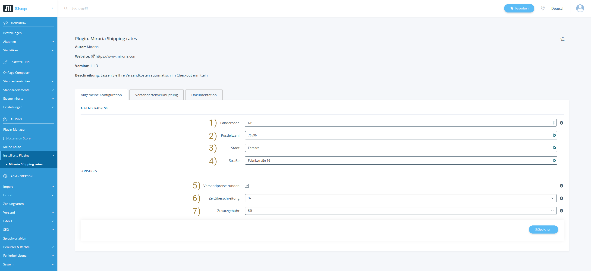
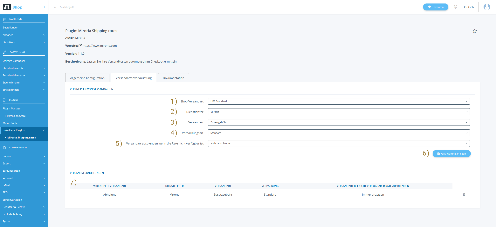
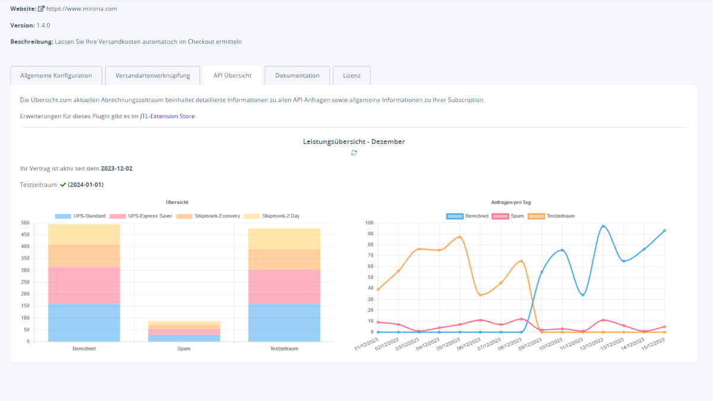

# Miroria Shipping rates

---
## Installationsanleitung für "Versandkosten und Lieferzeit automatisch beziehen - Basis Plugin"

Diese Anleitung führt Sie durch den Installationsprozess des Plugins "Versandkosten und Lieferzeit automatisch beziehen - Basis Plugin" für JTL Shop. Sie enthält auch Schritte zur Überprüfung der korrekten Installation.

### Schritt 1: Plugin erwerben

1. Besuchen Sie den Extension Store.
2. Suchen Sie nach "Versandkosten und Lieferzeit automatisch beziehen - Basis Plugin" und erwerben Sie es entsprechend.

### Schritt 2: Plugin installieren

1. Öffnen Sie den Admin-Bereich Ihres JTL Shops.
2. Navigieren Sie zu `"Plugins" > "Plugin Manager"`.
3. Suchen Sie nach dem erworbenen Plugin in der Plugin-Liste.
4. Klicken Sie auf "Installieren", um den Installationsprozess zu starten.
5. Aktivieren Sie die Shop-Einstellung Nr 13 und 17 (Bundesland abfragen) um möglichst genauere Versandkosten und Lieferzeiten zu erhalten

### Schritt 3: Überprüfung

1. Navigieren Sie zu den Plugin-Einstellungen unter `"Plugins" > "Installierte Plugins" > "Miroria Shipping Rates"`.
2. Setzen Sie die Einstellung `Zusatzgebühr` auf 10%.
3. Verknüpfen Sie eine Versandart in den Plugin-Einstellungen unter `Versandarten`.
4. Besuchen Sie Ihren JTL Shop und legen Sie ein Produkt in den Warenkorb.
5. Gehen Sie zum Checkout und wählen Sie die verknüpfte Versandart aus.
6. Überprüfen Sie, ob der Versandpreis im Checkout um 10% erhöht ist.

Herzlichen Glückwunsch! Wenn der Versandpreis entsprechend erhöht wurde, haben Sie erfolgreich das "Versandkosten und Lieferzeit automatisch beziehen - Basis Plugin" in Ihren JTL Shop integriert.

Bei Problemen oder Fragen können Sie sich an support@miroria.de wenden.

---
## Konfiguration & Bedienung

Diese Anleitung führt Sie durch die Konfiguration und Bedienung des Plugins "Versandkosten und Lieferzeit automatisch beziehen - Basis Plugin" für JTL Shop. Die Plugin-Konfiguration ist in zwei Abschnitte unterteilt: Die Allgemeine Konfiguration und die Versandartenverknüpfung.
1. Öffnen Sie den Admin-Bereich Ihres JTL Shops.
2. Navigieren Sie zu `"Plugins" > "Installierte Plugins" > "Miroria Shipping Rates"`.

### Allgemeine Konfiguration
Hier können Sie allgemeine Plugin-Konfigurationen vornehmen.

`API-Konfiguration`:

1. `API-Key`: Beantragen Sie [hier](https://www.miroria.de/jtl-versandkosten-und-lieferzeiten/#zugang-beantragen) einen API-Key

`Absenderadresse`: Bei der Installation des Plugins wird sie auf die im Shop hinterlegte Firmenadresse gesetzt.

2. `Zeitzone`: Die Zeitzone in welcher sich Ihr Unternehmen befindet.
3. `Ländercode`: Der [ISO-Ländercode](https://en.wikipedia.org/wiki/ISO_3166-1_alpha-2#Officially_assigned_code_elements) der Absenderadresse
4. `Postleitzahl`: Die PLZ der Absenderadresse
5. `Stadt`: Der Ort der Absenderadresse
6. `Straße`: Die Straße der Absenderadresse

`Sonstiges`:

7. `Versandpreise runden`: Versandpreise können auf die erste Nachkommastelle gerundet werden. Wird beispielsweise ein Versandpreis von 5.76€ ermittelt wird dieser auf 5.80€ gerundet. 
8. `Zeitüberschreitung`: Hier kann eine Zeitüberschreitung definiert werden. Anfragen gegen die Versanddienstleister werden nach Überschreitung abgebrochen und es werden als Fallback-Preis und Lieferzeit die in der Versandart definierten Werte verwendet.
9. `Zusatzgebühr`: Sie können außerdem einen Zusatzgebühren-Prozentsatz einstellen. Dieser wird auf die Versandkosten gerechnet.

### Versandartenverknüpfung
Hier können Sie Versandarten aus dem Shop mit den Versanddienstleistern verknüpfen.

1. `Shop Versandart`: Auswahl an im Shop unter `"Administration" > "Versand" > "Versandarten"` definierten Versandarten
2. `Dienstleister`: Auswahl an verfügbaren Dienstleistern. Fügen Sie weitere Dienstleister durch unsere [Extensions]() hinzu.
Im Basis-Plugin gibt es die Option eine Versandart `Zusatzgebühr` zu verwenden. Auf die verknüpfte Versandart wird dann die konfigurierte `Zusatzgebühr` gerechnet.
   Bisher verfügbare Extensions:
   1. [UPS]()

   In Planung: 
   1. Shipmonk
   2. DHL
   3. FedEx
3. `Versandart`: Vom Dienstleister bereitgestellte Versandarten.
4. `Verpackungsart`: Vom Dienstleister bereitgestellte Verpackungsarten.
5. `Versandart ausblenden wenn die Rate nicht verfügbar ist`: Soll die Versandart im Warenkorb ausgeblendet werden, wenn die Rate nicht vom Dienstleister bezogen werden konnte
6. `Verknüpfung anlegen`: Anlegen und freischalten der Verknüpfung.
7. `Versandverknüpfungen`: Hier können Sie bereits verknüpfte Versandarten sehen und löschen.

### API Übersicht
Hier haben Sie einen schnellen Überblick zur Verwendung der verknüpften Versandarten des aktuellen monats.

## Bedienung des Plugins im Shop

1. Nach der Konfiguration wird das Plugin automatisch die Versandkosten und Lieferzeit entsprechend der Einstellungen vom Versanddienstleister beziehen.
2. Die Kunden sehen die angepassten Versandinformationen während des Checkouts oder beim Versandkosten ermitteln.

## Verwendung in Templates
Das Plugin nimmt Anpassungen am Template "step3_shipping_options.tpl" und "shipping_calculator.tpl" vor.
Wenn Sie Anpassungen an den Templates benötigen können Sie uns per `support@miroria.de` kontaktieren und wir melden uns mit einem Angebot zurück.

Herzlichen Glückwunsch! Sie haben erfolgreich das Plugin "Versandkosten und Lieferzeit automatisch beziehen - Basis Plugin" konfiguriert und können es nun im Shop verwenden.

Bei Problemen oder Fragen könnnen Sie sich an support@miroria.de wenden.